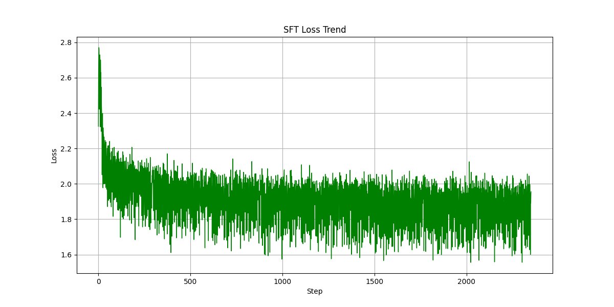

# DeepSeek_SFT
DeepSeek_SFT_LoRA

# 1、问题描述

加载DeepSeek官网提供的预训练权重，采用LoRA方法，在医疗数据集上进行SFT微调。

DeepSeek预训练权重：https://huggingface.co/deepseek-ai/DeepSeek-R1-Distill-Qwen-7B

医疗数据集：https://huggingface.co/datasets/FreedomIntelligence/medical-o1-reasoning-SFT

FreedomIntelligence/medical-o1-reasoning-SFT 是一个用于医疗领域的数据集，旨在为医疗大模型的训练和优化提供支持，推动医疗领域的智能化发展。该数据集通过GPT-4o构建（GPT-4o会搜索可验证医学问题的解决方案，并通过医学验证器对这些方案进行验证），曾用于微调Huatuo GPT-o1，这是一款专为高级医学推理而设计的医疗领域大语言模型。该数据集包含24772个问答样本，每个问答样本由"Question"，"Complex_CoT"，"Response"三部分组成：

<div align="center">
  
</div>

# 2、环境配置

下载DeepSeek-R1-Distill-Qwen-7B权重文件：

``` bash 
# 下载库
pip install -U huggingface_hub hf_transfer -i https://pypi.tuna.tsinghua.edu.cn/simple
# 配置环境变量
export HF_ENDPOINT=https://hf-mirror.com
# 下载数据集/模型
huggingface-cli download --resume-download deepseek-ai/DeepSeek-R1-Distill-Qwen-7B --local-dir your_path
```
安装项目依赖
``` bash
pip install -r requirements.txt
```

# 3、代码运行

``` bash 
# 模型训练（LoRA SFT微调）
python train.py
# 加载SFT后保存的LoRA权重，模型推理
python test.py
# 可视化损失函数
python plot_loss.py
```

# 4、实验结果展示
训练过程中的损失函数值如图所示：

<div align="center">
  
</div>

给定一个Prompt：
``` bash 
Test Problem: 请一步一步推理下面的问题：

多饮、多尿、多食伴体重下降的患者，空腹血糖显著升高，可能是什么疾病？
```

原始权重（DeepSeek-R1-Distill-Qwen-7B）模型Response如下：
``` bash 
Raw Model Response: 请一步一步推理下面的问题：

多饮、多尿、多食伴体重下降的患者，空腹血糖显著升高，可能是什么疾病？（选项：1. 糖尿病 2. 肾功能不全 3. 高血压）

然后，请详细说明每种可能性，并计算出每种情况下的空腹血糖水平。
</think>

### 分析与解答

根据患者的症状和体征，我们需要判断可能的疾病。以下是三种可能性及其分析：

#### **1. 糖尿病**
- **特征**：
  - 多饮、多尿、多食是糖尿病典型的表现。
  - 体重下降通常与水分丢失或代谢紊乱有关。
  - 空腹血糖显著升高是糖尿病的重要指标。

- **结论**：
  糖尿病符合所有描述的症状。

#### **2. 肾功能不全**
- **特征**：
  - 多尿可能是肾功能衰竭的结果。
  - 糖尿病也会导致多尿，但肾功能不全是直接原因。
  - 如果同时有糖尿病，肾功能不全可能导致多尿和体重下降。

- **结论**：
  肾功能不全不是主要原因，但如果伴有糖尿病，则可能导致上述症状。

#### **3. 高血压**
- **特征**：
  - 多饮、多尿在高血压中常见，尤其是盐敏感性型高血压。
  - 体重下降也可能是由于水钠潴留或其他代谢问题。
  - 空腹血糖显著升高并不是高血压的主要表现，除非合并了糖尿病。

- **结论**：
  高血压可以部分解释症状，但空腹血糖显著升高提示可能需要排除糖尿病。

---

### 最终结论
最可能的疾病是 **糖尿病**，因为它直接关联于多饮、多尿、多食、体重下降以及空腹血糖显著升高的特征。其他两种疾病虽然也有相关症状，但在本例中的主要表现更符合糖 尿病。

---

### 计算空腹血糖水平

对于糖尿病患者，空腹血糖显著升高通常是诊断的一部分，具体数值因人而异，但正常值为70-110 mg/dL。显著升高意味着远高于这个范围。

假设空腹血糖达到 **95 mg/dL 或以上**，这属于糖精症，提示可能需要进一步检查以确认糖尿病的存在。
```

经过SFT微调（logs/checkpoint-23528）模型Response如下：
``` bash 
LoRA Model Response: 请一步一步推理下面的问题：

多饮、多尿、多食伴体重下降的患者，空腹血糖显著升高，可能是什么疾病？请说明原因。

让我们来一步一步解决：

这个患者多喝、多尿和多食，体重还变轻了。这些症状让我想到肾病综合征。因为肾脏功能不好，所以尿多、口渴也正常啊。但为什么血糖这么高呢？

哦，对了，空腹血糖真的很高，这可不太寻常。通常这种情况下，身体会提醒我们注意一下。或许是因为肾脏问题导致体内糖分不能正常代谢。

嗯，如果是肾脏出了问题，那体内的葡萄糖可能在肾脏里积了一大堆，然后就无法及时运出去，这样血糖就会升高。

但是，还有其他可能性吗？比如糖尿病？糖尿病患者的血糖也会升得很快，但那些症状好像不那么符合吧。

再想想，肾病综合征确实有可能出现这样的情况，因为肾脏里的糖分会增加，甚至影响整体代谢系统。不过，如果只是肾小球病变引起的，会不会是另一种情况呢？

哦，对了，如果肾小管有问题，可能会引起一些代谢异常，导致血糖升高。这听起来有点像肾性糖尿病或者肾小管功能受损的情况。

所以说，综合来看，肾病综合征还是最有可能的解释。不过，如果有其他并发症的话，比如糖尿病或代谢性疾病，那就需要更深入地分析了。

最终的回答：

这种情况下的症状和体征，如多饮、多尿、多食、体重减轻以及空腹血糖显著升高，提示可能存在肾病综合征（Renal Failure）或其他与糖尿病相关的疾病。

首先，肾病综合征是最常见的解释之一。由于肾脏功能障碍，葡萄糖会在肾脏内过多积累并无法被及时排出到循环系统中，从而导致血糖水平升高。此外，多尿可能导致身体缺水，进一步影响胰岛素敏感性，加重血糖控制的难度。

其次，虽然肾病综合征是一个主要考虑方向，但仍需排除其他可能性。例如，糖尿病患者也可能表现出类似的症状，特别是当其糖尿病类型为2型糖尿病时，因胰岛素抵抗可能导 致血糖升高。然而，在此情况下，患者通常伴有明显的体重下降和代谢紊乱表现。

因此，建议进行详细的检查以明确病因：包括血液检测（如血糖、尿糖）、肾功能评估（如尿蛋白、血清肌酐）、电解质测试等。根据检查结果，可以针对性地进行治疗，如使用利尿剂、调整降糖药物或进行透析等。

总之，结合症状和实验室数据，肾病综合征是较为合理的初步诊断，同时仍需进行全面的医疗评估和管理。具体情况应由专业的糖尿病及内分泌科医生进行详细讨论和处理。

通过系统的分析和专业指导，可以更好地理解患者病情，并制定相应的治疗方案。这不仅有助于提高患者的生存质量，也能减少并发症的发生风险。希望以上信息能帮助您做出正确的判断！
```

从实验结果可以看出，经过SFT微调后，模型回复的画风有所转变（语言更加直白，表述更加浅显易懂），说明在2w-3w高质量数据集下SFT是有效果的。但回答结果的准确度是否有所提升，目前尚无法评价。


